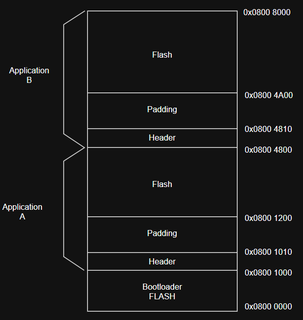
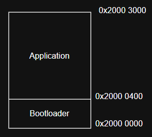

# bootloader

# Issues + Fixes
Issue: after adding header bytes for the dual image bootloader, my application code suddenly stopped functioning
Before i had header bytes, the app code was working fine. when i added the header bytes, i saw that the application code
wasnt printing an ASCII char every second to putty, instead it would just print 1 character.

to investigate, i learned that i could load symbols so that i could debug and set breakpoints in the startup and main function of the application 
code. i stepped through into the while loop that had a delay function and added a break into the delay function. everything was working fine until
out of nowhere the code would just randomly jump to an invalid address. i suspected that it as some interrupt handler since the disassembly had no invalid
address it was jumping to. when i disabled interrupts, the code no longer crashed. after consulting AI i found out that the vector table was supposed to be 
aligned on a 512 byte address, and when i adjusted the linker script the bootloader code for that it finally ended up working

# Potential Improvements
## buffer of 500 bytes to store application flash
currently using a buffer size of 500 bytes to hold application bytes, which is too small for the current max application size of 13824 bytes
Possible solutions:
* increase buffer size to 14000: this would inflate bootloader SRAM and the total microcontroller SRAM does not have enough capacity to hold that many bytes. If it could then implementing this solution is incredibly straightforward
* read from firmware updater and flash every 500 bytes and repeat until we have transferred all the application bytes: this solution is optimal compared to the previous solution in terms of space but would require more complicated code
## reduce the padding
padding is currently used to align the vector table to 512 byte boundary. a potential solution is in the application slot, put the application flash at lower addresses and the header bytes at higher addresses since the header bytes don't require any alignment requirements.

